# Ex.07 Restaurant Website
## Date:21/12/2024

## AIM:
To develop a static Restaurant website to display the food items and services provided by them.

## DESIGN STEPS:

### Step 1:
Requirement collection.

### Step 2:
Creating the layout using HTML and CSS.

### Step 3:
Updating the sample content.

### Step 4:
Choose the appropriate style and color scheme.

### Step 5:
Validate the layout in various browsers.

### Step 6:
Validate the HTML code.

### Step 7:
Publish the website in the given URL.

## PROGRAM:
```
home.html


<html lang="en">
<head>
    
    <title>THE TRADITIONAL TABLE - Home</title>
    <style>
      
        body {
            margin: 0;
            font-family: 'Arial', sans-serif;
            line-height: 1.6;
            color: #333;
            box-sizing: border-box;
        }

        *, *::before, *::after {
            box-sizing: inherit;
        }

        header {
            background: #5a047c;
            color: #333;
            padding: 10px 20px;
            display: flex;
            align-items: center;
            justify-content: space-between;
            box-shadow: 0 4px 6px rgba(0, 0, 0, 0.1);
        }

        header img {
            height: 40px;
        }

        header nav a {
            text-decoration: none;
            color: #f9f9f9;
            font-weight: bold;
            margin: 0 10px;
            transition: color 0.3s ease;
        }

        header nav a:hover {
            color: #5e0878;
        }

        .banner {
            display: flex;
            align-items: center;
            justify-content: space-between;
            padding: 30px 20px;
            background: url('banner-placeholder.jpg') no-repeat center center/cover;
            color: white;
            height: 220px;
            text-shadow: 0 2px 4px rgba(0, 0, 0, 0.8);
        }

        .banner-content {
            max-width: 50%;
        }

        .banner-content h1 {
            font-family: Georgia, 'Times New Roman', Times, serif;
            font-size: 2 rem;
            margin-bottom: 10px;
            color: rgb(96, 4, 124);
        }

        .banner-content p {
            font-size: 1rem;
            margin-bottom: 15px;
            color: black;
        }

        .banner-content a {
            background: #7b0293;
            color: white;
            padding: 8px 15px;
            text-decoration: none;
            font-weight: bold;
            border-radius: 5px;
            transition: background 0.3s ease;
        }

        .banner-content a:hover {
            background: #80049f;
        }

        .features {
            display: flex;
            justify-content: space-between;
            align-items: flex-start;
            padding: 20px;
            gap: 15px;
            background: #f9f9f9;
        }

        .feature {
            background: white;
            border-radius: 10px;
            padding: 15px;
            box-shadow: 0 4px 6px rgba(0, 0, 0, 0.1);
            flex: 1;
            text-align: center;
        }

        .feature img {
            width: 100%;
            border-radius: 10px;
            margin-bottom: 10px;
        }

        .feature h3 {
            font-size: 1.2rem;
            margin-bottom: 10px;
            color: #1f1714;
        }

        .feature p {
            font-size: 0.9rem;
            color: #555;
        }

        footer {
            background: #333;
            color: white;
            text-align: center;
            padding: 10px 0;
            margin-top: 10px;
        }

        footer a {
            color: #ff5722;
            text-decoration: none;
            font-weight: bold;
            transition: color 0.3s ease;
        }

        footer a:hover {
            color: #ffdd57;
        }

        @media (max-width: 768px) {
            .banner {
                flex-direction: column;
                height: auto;
                text-align: center;
            }

            .banner-content {
                max-width: 100%;
            }

            .features {
                flex-direction: column;
                gap: 20px;
            }

            .feature {
                flex: none;
            }

            header nav a {
                margin: 0 5px;
            }
        }
    </style>
</head>
<body>

    <header>
        
        <nav>
            <a href="home.html">Home</a>
            <a href="menu.html">Menu</a>
            <a href="reservation.html">Reservations</a>
            <a href="contact.html">Contact</a>
            <a href="admin.html">Administration</a>
        </nav>
    </header>

    <div class="banner">
        <div class="banner-content">
            <h1>Welcome to THE TRADITIONAL TABLE</h1>
            <p>Experience the finest flavors and a cozy ambiance at Olive Garden. We serve happiness on a plate!</p>
            <a href="#features">Explore Now</a>
        </div>
    </div>

    <section id="features" class="features">
        <div class="feature">
            
            <h3>Fresh Ingredients</h3>
            <p>We source only the freshest and most organic ingredients to create our dishes.</p>
        </div>
        <div class="feature">
            
            <h3>Cozy Ambiance</h3>
            <p>Enjoy your meals in a warm, welcoming, and beautifully designed space.</p>
        </div>
        <div class="feature">
            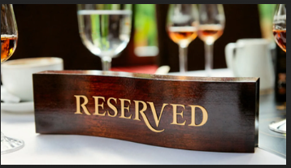
            <h3>Easy Reservations</h3>
            <p>Book your table in seconds and guarantee yourself an unforgettable experience.</p>
        </div>
    </section>

    <footer>
        <p>&copy; 2024 THE TRADITIONAL TABLE. All rights reserved. | <a href="#">Privacy Policy</a></p>
    </footer>

</body>
</html>


admin.html


<html lang="en">
<head>
   
    <title>THE TRADITIONAL TABLE</title>
    <style>
        body {
            margin: 0;
            font-family: 'Arial', sans-serif;
            line-height: 1.6;
            color: #333;
            box-sizing: border-box;
        }

        *, *::before, *::after {
            box-sizing: inherit;
        }

        header {
            background: #700b8f;
            color: #fff;
            padding: 10px 20px;
            display: flex;
            align-items: center;
            justify-content: space-between;
            box-shadow: 0 4px 6px rgba(0, 0, 0, 0.1);
        }

        header nav a {
            text-decoration: none;
            color: #f9f9f9;
            font-weight: bold;
            margin: 0 10px;
            transition: color 0.3s ease;
        }

        header nav a:hover {
            color: #ffdd57;
        }

        header h1 {
            font-size: 1.5rem;
        }

        .admin-container {
            padding: 20px;
            background: #f9f9f9;
            text-align: center;
        }

        .admin-container h1 {
            font-size: 2rem;
            color: #650f7d;
            margin-bottom: 20px;
        }

        .admin-items {
            display: flex;
            flex-wrap: wrap;
            gap: 20px;
            justify-content: center;
        }

        .admin-item {
            background: white;
            border-radius: 10px;
            box-shadow: 0 4px 6px rgba(0, 0, 0, 0.1);
            width: 300px;
            overflow: hidden;
            transition: transform 0.3s ease;
            text-align: left;
        }

        .admin-item img {
            width: 100%;
            height: 200px;
            object-fit: cover;
        }

        .admin-item:hover {
            transform: scale(1.05);
        }

        .admin-details {
            padding: 15px;
        }

        .admin-details h3 {
            font-size: 1.2rem;
            color: #610b74;
            margin-bottom: 8px;
        }

        .admin-details p {
            font-size: 0.9rem;
            color: #555;
            margin-bottom: 10px;
        }

        footer {
            background: #333;
            color: white;
            text-align: center;
            padding: 10px 0;
            margin-top: 10px;
        }

        footer a {
            color: #ff5722;
            text-decoration: none;
            font-weight: bold;
            transition: color 0.3s ease;
        }

        footer a:hover {
            color: #ffdd57;
        }

        @media (max-width: 768px) {
            header h1 {
                font-size: 1.2rem;
            }

            .admin-items {
                flex-direction: column;
                gap: 20px;
            }

            .admin-item {
                width: 100%;
            }

            header nav a {
                margin: 0 5px;
            }
        }
    </style>
</head>
<body>

    <header>
        
        <h1>THE TRADITIONAL TABLE </h1>
        <nav>
            <a href="home.html">Home</a>
            <a href="menu.html">Menu</a>
            <a href="reservation.html">Reservations</a>
            <a href="contact.html">Contact</a>
            <a href="admin.html">Administration</a>
        </nav>
    </header>

    <div class="admin-container">
        <h1>Our Leadership Team</h1>
        <div class="admin-items">
            <div class="admin-item">
                
                <div class="admin-details">
                    <h3>Jaasir Sulthan</h3>
                    <p>CEO - Leading THE TRADITIONAL TABLE with a vision of excellence and innovation in hospitality.</p>
                </div>
            </div>

            <div class="admin-item">
                
                <div class="admin-details">
                    <h3>Hannah</h3>
                    <p>Manager - Ensures smooth operations and a great dining experience for all guests.</p>
                </div>
            </div>

            <div class="admin-item">
                
                <div class="admin-details">
                    <h3>Atlas</h3>
                    <p>Master Chef - Brings authentic Italian flavors to every dish served.</p>
                </div>
            </div>

            <div class="admin-item">
                
                <div class="admin-details">
                    <h3>Kristy</h3>
                    <p>Assistant Managing Director - Supporting the team with strategy and execution excellence.</p>
                </div>
            </div>
        </div>
    </div>

    <footer>
        <p>&copy;THE TRADITIONAL TABLE. All rights reserved. | <a href="home.html">Back to Home</a></p>
    </footer>

</body>
</html>


contact.html


<!DOCTYPE html>
<html lang="en">
<head>
    
    <title>THE TRADITIONAL TABLE - Contact Us</title>
    <style>
        body {
            margin: 0;
            font-family: 'Arial', sans-serif;
            line-height: 1.6;
            color: #333;
            box-sizing: border-box;
        }

        *, *::before, *::after {
            box-sizing: inherit;
        }

        header {
            background: #7d15a0;
            color: #333;
            padding: 15px 30px;
            display: flex;
            align-items: center;
            justify-content: space-between;
            box-shadow: 0 4px 6px rgba(0, 0, 0, 0.1);
        }

        header img {
            height: 50px;
        }

        header nav a {
            text-decoration: none;
            color: #f9f9f9;
            font-weight: bold;
            margin: 0 10px;
            transition: color 0.3s ease;
        }

        header nav a:hover {
            color: #4b0574;
        }

        .contact-banner {
            display: flex;
            align-items: center;
            justify-content: center;
            background: url('contact.jpeg') no-repeat center center/cover;
            color: white;
            height:10 px;
            text-shadow: 0 2px 4px rgba(0, 0, 0, 0.8);
        }

        .contact-banner h1 {
            font-family: Georgia, 'Times New Roman', Times, serif;
            font-size: 2.5rem;
            color: #f9f9f9;
        }

        .contact-section {
            display: flex;
            flex-wrap: wrap;
            justify-content: center;
            padding: 30px 15px;
            background: #f9f9f9;
            gap: 20px;
        }

        .contact-details, .contact-form {
            flex: 1;
            max-width: 500px;
            margin: 10px;
            background: white;
            padding: 20px;
            border-radius: 10px;
            box-shadow: 0 4px 6px rgba(0, 0, 0, 0.1);
        }

        .contact-details h2, .contact-form h2 {
            font-size: 1.8rem;
            margin-bottom: 15px;
            color: #1f1714;
            text-align: center;
        }

        .contact-details p {
            margin: 10px 0;
            font-size: 1rem;
            color: #555;
        }

        .contact-details img {
            max-width: 100%;
            border-radius: 10px;
            margin-bottom: 20px;
        }

        .contact-form input, .contact-form textarea {
            width: 100%;
            padding: 10px;
            margin: 10px 0;
            border: 1px solid #ccc;
            border-radius: 5px;
            font-size: 1rem;
        }

        .contact-form textarea {
            height: 100px;
        }

        .contact-form button {
            width: 100%;
            padding: 10px;
            background: #8f4ce6;
            color: white;
            font-size: 1.1rem;
            border: none;
            border-radius: 5px;
            cursor: pointer;
            transition: background 0.3s ease;
        }

        .contact-form button:hover {
            background: #a007c6;
        }

        footer {
            background: #333;
            color: white;
            text-align: center;
            padding: 15px 0;
        }

        footer a {
            color: #ff5722;
            text-decoration: none;
            font-weight: bold;
            transition: color 0.3s ease;
        }

        footer a:hover {
            color: #ffdd57;
        }

        @media (max-width: 768px) {
            .contact-details, .contact-form {
                max-width: 100%;
            }

            .contact-banner h1 {
                font-size: 2rem;
            }
        }
    </style>
</head>
<body>

    <header>
        
        <nav>
            <a href="home.html">Home</a>
            <a href="menu.html">Menu</a>
            <a href="reservation.html">Reservations</a>
            <a href="contact.html">Contact</a>
            <a href="admin.html">Administration</a>
        </nav>
    </header>

    <div class="contact-banner">
     
    </div>

    <section class="contact-section">
        <div class="contact-details">
            <h2>Get in Touch</h2>
            <p><strong>Address:</strong> 123 The Traditional Table,Pondichery,Tamilnadu, India</p>
            <p><strong>Phone:</strong> +91 8766749387</p>
            <p><strong>Email:</strong> contact@thetraditionaltable.com</p>
            <p><strong>Hours:</strong> Mon-Sun: 10 AM - 10 PM</p>
        </div>

        <div class="contact-form">
            <h2>Send Us a Message</h2>
            <form action="/submit-contact" method="POST">
                <label for="name">Full Name</label>
                <input type="text" id="name" name="name" placeholder="Enter your full name" required>

                <label for="email">Email Address</label>
                <input type="email" id="email" name="email" placeholder="Enter your email address" required>

                <label for="message">Message</label>
                <textarea id="message" name="message" placeholder="Your message" required></textarea>

                <button type="submit">Send Message</button>
            </form>
        </div>
    </section>

    <footer>
        <p>&copy; 2024 THE TRADITIONAL TABLE. All rights reserved. | <a href="#">Privacy Policy</a></p>
    </footer>

</body>
</html>


menu.html


<html lang="en">
<head>
    
    <title>THE TRADITIONAL TABLE- Menu</title>
    <style>
        body {
            margin: 0;
            font-family: 'Arial', sans-serif;
            line-height: 1.6;
            color: #333;
            box-sizing: border-box;
        }

        *, *::before, *::after {
            box-sizing: inherit;
        }

        header {
            background: #670d82;
            color: #fff;
            padding: 10px 20px;
            display: flex;
            align-items: center;
            justify-content: space-between;
            box-shadow: 0 4px 6px rgba(0, 0, 0, 0.1);
        }

        header nav a {
            text-decoration: none;
            color: #f9f9f9;
            font-weight: bold;
            margin: 0 10px;
            transition: color 0.3s ease;
        }

        header nav a:hover {
            color: #ffdd57;
        }

        header h1 {
            font-size: 1.5rem;
        }

        .menu-container {
            padding: 20px;
            background: #f9f9f9;
            text-align: center;
        }

        .menu-container h1 {
            font-size: 2rem;
            color: #670c80;
            margin-bottom: 15px;
        }

        .menu-items {
            display: flex;
            flex-wrap: wrap;
            gap: 15px;
            justify-content: center;
        }

        .menu-item {
            background: white;
            border-radius: 10px;
            box-shadow: 0 4px 6px rgba(0, 0, 0, 0.1);
            width: 280px;
            overflow: hidden;
            transition: transform 0.3s ease;
        }

        .menu-item img {
            width: 100%;
            height: 180px;
            object-fit: cover;
        }

        .menu-item:hover {
            transform: scale(1.05);
        }

        .menu-details {
            padding: 10px;
        }

        .menu-details h3 {
            font-size: 1.2rem;
            color: #630b7e;
            margin-bottom: 8px;
        }

        .menu-details p {
            font-size: 0.9rem;
            color: #555;
            margin-bottom: 10px;
        }

        .menu-details .price {
            font-weight: bold;
            font-size: 1rem;
            color: #ff5722;
        }

        footer {
            background: #333;
            color: white;
            text-align: center;
            padding: 10px 0;
            margin-top: 10px;
        }

        footer a {
            color: #ff5722;
            text-decoration: none;
            font-weight: bold;
            transition: color 0.3s ease;
        }

        footer a:hover {
            color: #ffdd57;
        }

        @media (max-width: 768px) {
            header h1 {
                font-size: 1.2rem;
            }

            .menu-items {
                flex-direction: column;
                gap: 20px;
            }

            .menu-item {
                width: 100%;
            }

            header nav a {
                margin: 0 5px;
            }
        }
    </style>
</head>
<body>

    <header>
        <h1>THE TRADITIONAL TABLE</h1>
        <nav>
            <a href="home.html">Home</a>
            <a href="menu.html">Menu</a>
            <a href="reservation.html">Reservations</a>
            <a href="contact.html">contact</a>
            <a href="admin.html">Administration</a>
        </nav>
    </header>

    <div class="menu-container">
        <h1>Our Menu</h1>
        <div class="menu-items">
            <div class="menu-item">
                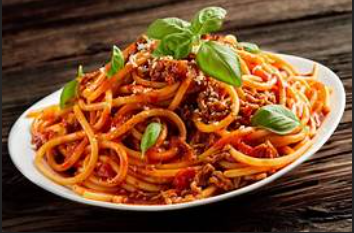
                <div class="menu-details">
                    <h3>Classic Spaghetti</h3>
                    <p>Delicious spaghetti tossed in a rich tomato sauce, topped with Parmesan.</p>
                    <p class="price">₹250/-</p>
                </div>
            </div>

            <div class="menu-item">
                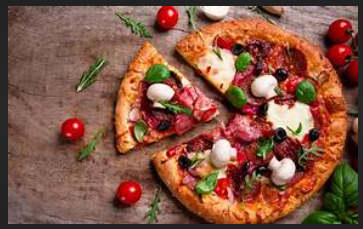
                <div class="menu-details">
                    <h3>Margherita Pizza</h3>
                    <p>Wood-fired pizza topped with fresh basil, tomatoes, and mozzarella.</p>
                    <p class="price">₹270/-</p>
                </div>
            </div>

            <div class="menu-item">
                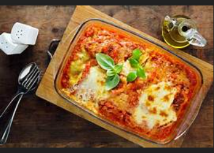
                <div class="menu-details">
                    <h3>Cheesy Lasagna</h3>
                    <p>Layered lasagna with a creamy blend of cheese and savory sauce.</p>
                    <p class="price">₹310/-</p>
                </div>
            </div>

            <div class="menu-item">
                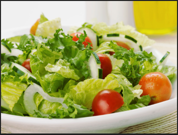
                <div class="menu-details">
                    <h3>Garden Fresh Salad</h3>
                    <p>Crisp lettuce, cucumbers, and tomatoes served with house dressing.</p>
                    <p class="price">₹190/-</p>
                </div>
            </div>

            
            <div class="menu-item">
                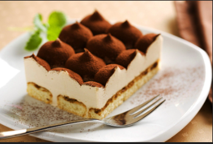
                <div class="menu-details">
                    <h3>Tiramisu</h3>
                    <p>A classic Italian dessert made with mascarpone and espresso-soaked ladyfingers.</p>
                    <p class="price">₹180/-</p>
                </div>
            </div>
        </div>
    </div>

    <footer>
        <p>&copy; 2024 THE TRADITIONAL TABLE. All rights reserved. | <a href="home.html">Back to Home</a></p>
    </footer>

</body>
</html>


reservation.html


<html lang="en">
<head>
    
    <title>THE TRADITIONAL TABLE - Reservations</title>
    <style>
        body {
            margin: 0;
            font-family: 'Arial', sans-serif;
            line-height: 1.6;
            color: #333;
            box-sizing: border-box;
        }

        *, *::before, *::after {
            box-sizing: inherit;
        }

        header {
            background: #66067e;
            color: #fff;
            padding: 10px 20px;
            display: flex;
            align-items: center;
            justify-content: space-between;
            box-shadow: 0 4px 6px rgba(0, 0, 0, 0.1);
        }

        header img {
            height: 40px;
        }

        header nav a {
            text-decoration: none;
            color: #f9f9f9;
            font-weight: bold;
            margin: 0 10px;
            transition: color 0.3s ease;
        }

        header nav a:hover {
            color: #6a0679;
        }

        .reservation-banner {
            display: flex;
            align-items: center;
            justify-content: center;
            background: url('restaurant-banner.jpg') no-repeat center center/cover;
            height: 110 px;
            text-align: center;
            color: white;
            text-shadow: 0 2px 4px rgba(0, 0, 0, 0.8);
        }

        .reservation-banner h1 {
            font-size: 3rem;
            margin: 0;
            color: #333;
            font-family: Cambria, Cochin, Georgia, Times, 'Times New Roman', serif;
        }

        .reservation-form {
            display: flex;
            justify-content: center;
            padding: 20px;
            background: #f9f9f9;
        }

        .form-container {
            background: white;
            padding: 20px;
            box-shadow: 0 4px 6px rgba(0, 0, 0, 0.1);
            border-radius: 10px;
            width: 100%;
            max-width: 500px;
        }

        .form-container h2 {
            font-size: 1.8rem;
            margin-bottom: 15px;
            color: #590a6d;
            text-align: center;
        }

        .form-container label {
            display: block;
            margin: 10px 0 5px;
            font-weight: bold;
        }

        .form-container input, .form-container select, .form-container textarea {
            width: 100%;
            padding: 10px;
            margin: 5px 0 15px;
            border: 1px solid #ccc;
            border-radius: 5px;
            font-size: 1rem;
        }

        .form-container button {
            width: 100%;
            padding: 10px;
            background: #640b8a;
            color: white;
            font-size: 1rem;
            border: none;
            border-radius: 5px;
            cursor: pointer;
            transition: background 0.3s ease;
        }

        .form-container button:hover {
            background: #700893;
        }

        footer {
            background: #333;
            color: white;
            text-align: center;
            padding: 10px 0;
            margin-top: 10px;
        }

        footer a {
            color: #690f85;
            text-decoration: none;
            font-weight: bold;
            transition: color 0.3s ease;
        }

        footer a:hover {
            color: #ffdd57;
        }

        @media (max-width: 768px) {
            header img {
                height: 30px;
            }

            .reservation-banner h1 {
                font-size: 1.5rem;
            }

            .form-container {
                padding: 15px;
            }
        }
    </style>
</head>
<body>
    <header>
        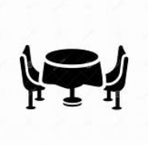
        <nav>
            <a href="home.html">Home</a>
            <a href="menu.html">Menu</a>
            <a href="reservation.html">Reservations</a>
            <a href="contact.html">Contact</a>
            <a href="admin.html">Administration</a>
        </nav>
    </header>

    <div class="reservation-banner">
        
        <h1>Reserve Your Table Today!</h1>
    </div>

    <section class="reservation-form">
        <div class="form-container">
            <h2>Make a Reservation</h2>
            <form action="/submit-reservation" method="POST">
                <label for="name">Full Name</label>
                <input type="text" id="name" name="name" placeholder="Enter your full name" required>

                <label for="email">Email Address</label>
                <input type="email" id="email" name="email" placeholder="Enter your email address" required>

                <label for="phone">Phone Number</label>
                <input type="tel" id="phone" name="phone" placeholder="Enter your phone number" required>

                <label for="date">Reservation Date</label>
                <input type="date" id="date" name="date" required>

                <label for="time">Reservation Time</label>
                <input type="time" id="time" name="time" required>

                <label for="guests">Number of Guests</label>
                <select id="guests" name="guests" required>
                    <option value="1">1</option>
                    <option value="2">2</option>
                    <option value="3">3</option>
                    <option value="4">4</option>
                    <option value="5">5</option>
                    <option value="6">6</option>
                    <option value="7">7</option>
                    <option value="8">8</option>
                    <option value="9">9</option>
                    <option value="10">10</option>
                </select>

                <label for="message">Special Requests</label>
                <textarea id="message" name="message" placeholder="Any special requests or dietary preferences?" rows="4"></textarea>

                <button type="submit">Reserve Now</button>
            </form>
        </div>
    </section>

    <footer>
        <p>&copy; 2024 THE TRADITIONAL TABLE. All rights reserved. | <a href="#">Privacy Policy</a></p>
    </footer>

</body>
</html>

```

## OUTPUT:


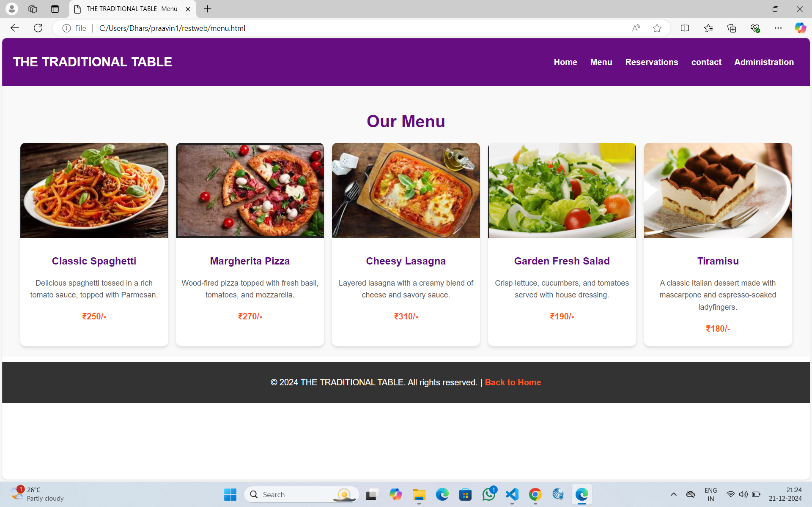
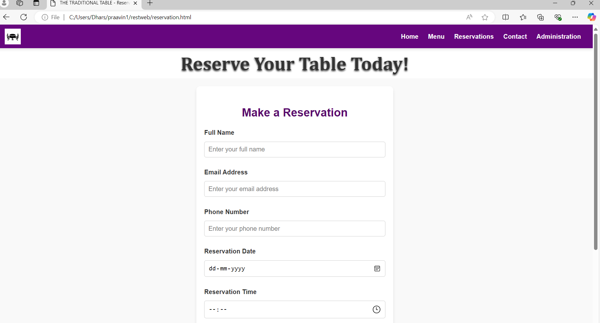
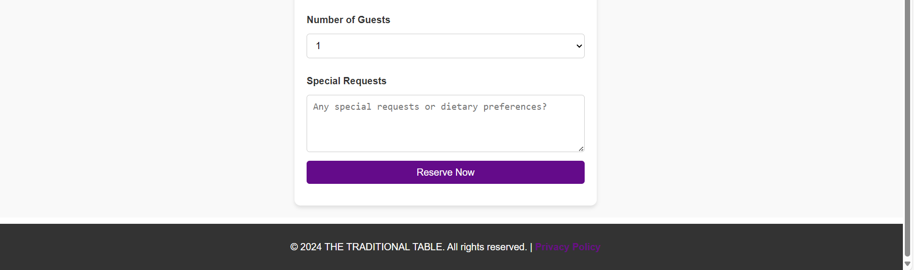

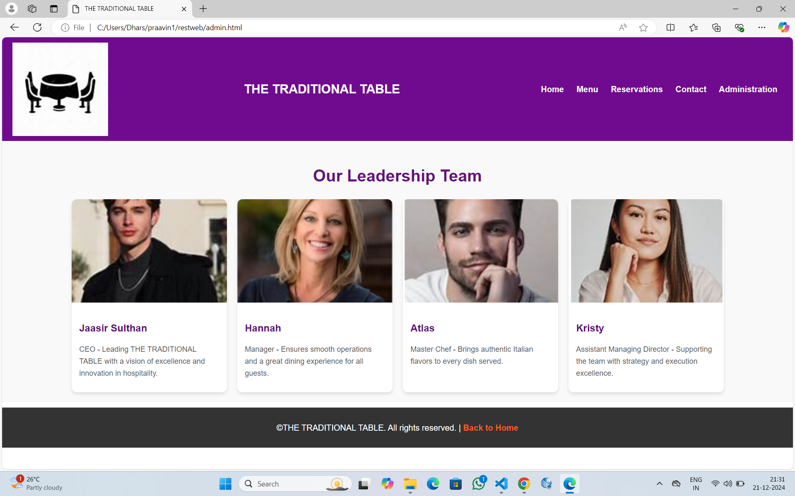


## RESULT:
The program for designing software company website using HTML and CSS is completed successfully.
